# Lab 01 - PowerShell Introduction

[< Back to all labs](../README.md)

Basic Windows command line lab. Each CMD command is run first, then the
PowerShell cmdlet that does the same thing.

Commands were run directly in the terminal. The files in `commands/` are just
a copy of what was typed, kept for reference.

## Command mapping

| Task | CMD | PowerShell |
|---|---|---|
| List files and folders | `dir` | `Get-ChildItem` |
| Change directory | `cd` | `Set-Location` |
| Copy a file | `copy` | `Copy-Item` |
| Delete a file | `del` | `Remove-Item` |
| Print a message | `echo` | `Write-Host` |
| Create a folder or file | `mkdir` / `type nul > file` | `New-Item` |
| Read a file | `type` | `Get-Content` |

## Setup

Windows 10 or 11. No admin rights needed.

Replace `<YourUsername>` in the paths with your own Windows account name.
Run `echo %USERNAME%` if you are not sure what it is.

The lab copies and deletes `file2.txt`, so create the sample files first:

```
cd C:\Users\<YourUsername>\Documents
echo test > file1.txt
echo test > file2.txt
```

## Part 1 - CMD

Open Command Prompt.

```
dir
cd C:\Users\<YourUsername>\Documents
copy "C:\Users\<YourUsername>\Documents\file2.txt" "C:\Users\<YourUsername>\Documents\file3.txt"
del C:\Users\<YourUsername>\Documents\file2.txt
echo Hello, World!
```

`dir`

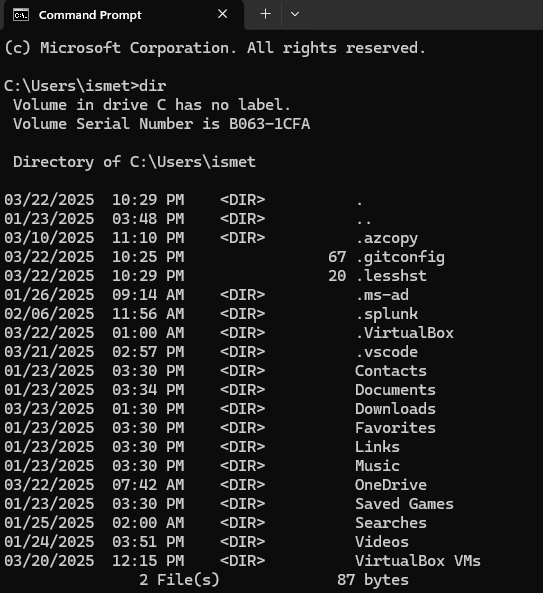

`cd`

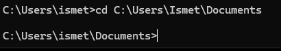

`copy`

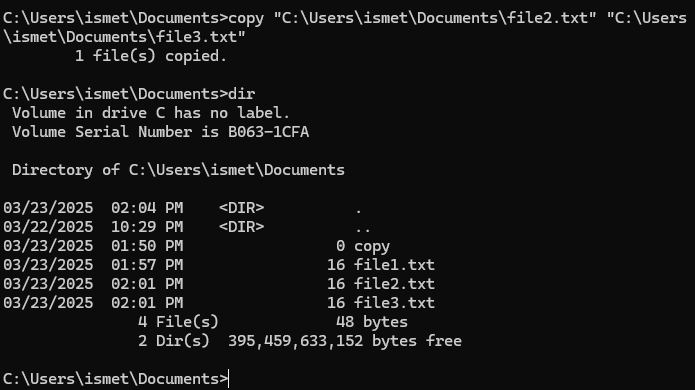

`del` — the first attempt failed because the prompt had moved up a level with
`cd ..`, so the relative path did not resolve. The full path worked.

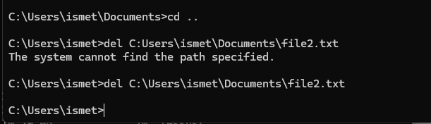

`echo`

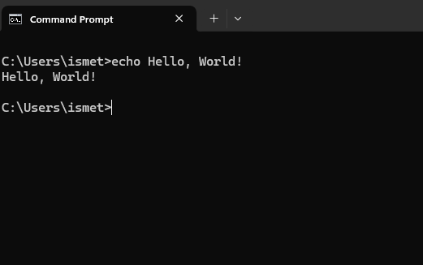

## Part 2 - PowerShell

Open PowerShell.

```
Get-ChildItem
Set-Location C:\Users\<YourUsername>\Documents
"Hello-World" | Out-File -FilePath C:\Users\<YourUsername>\Documents\file10.txt
Get-Content C:\Users\<YourUsername>\Documents\file10.txt
Remove-Item C:\Users\<YourUsername>\Documents\file10.txt
Write-Host "Hello World!"
```

`Get-ChildItem`

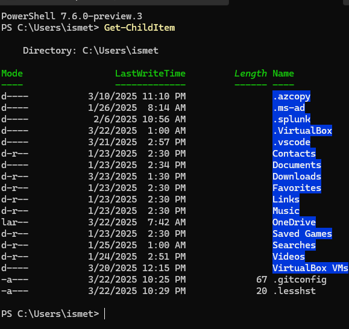

`Set-Location`

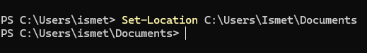

`Out-File` and `Get-Content` — `type` and `cat` are aliases for `Get-Content`.

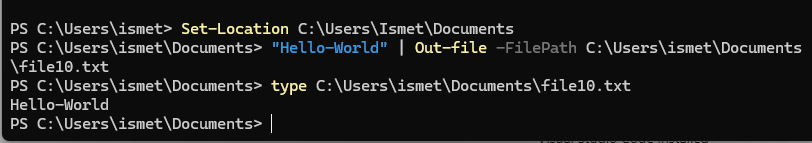

`Remove-Item` — the "cannot find path" error after deleting confirms it worked.

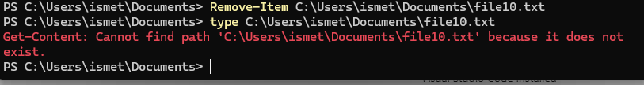

`Write-Host`

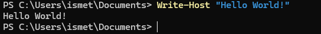

## Part 3 - Create a folder and file

```
Set-Location C:\Users\<YourUsername>\Documents
New-Item -Name "PowerShell Scripts" -ItemType Directory
Set-Location "C:\Users\<YourUsername>\Documents\PowerShell Scripts"
New-Item -Name "test.txt" -ItemType File
```

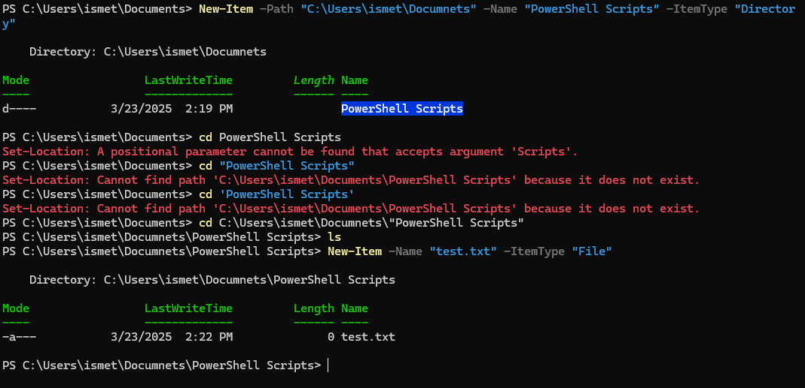

The folder name has a space in it, so `cd PowerShell Scripts` fails with
"A positional parameter cannot be found that accepts argument 'Scripts'".
Quoting the full path fixes it. Both attempts are visible in the screenshot.

Checked in File Explorer:

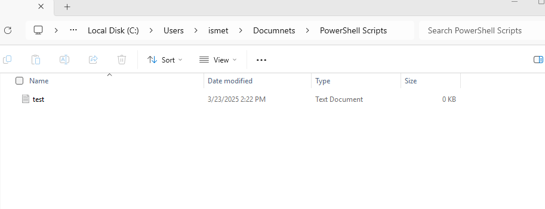

## Cleanup

```
Set-Location C:\Users\<YourUsername>\Documents
Remove-Item file1.txt, file2.txt, file3.txt -ErrorAction SilentlyContinue
Remove-Item "PowerShell Scripts" -Recurse -Force
```

## Notes

- `Get-ChildItem` returns objects, not text, so results can be sorted and
  filtered with the pipeline.
- `Write-Host` prints to the screen only. `Write-Output` sends the value down
  the pipeline so it can be captured.
- `Get-Help <cmdlet> -Examples` and `Get-Alias dir` are the fastest way to
  look things up without leaving the terminal.

## Files

```
commands/     the commands used, as typed
screenshots/  terminal output for each step
docs/         lab write-up (docx and pdf)
```
